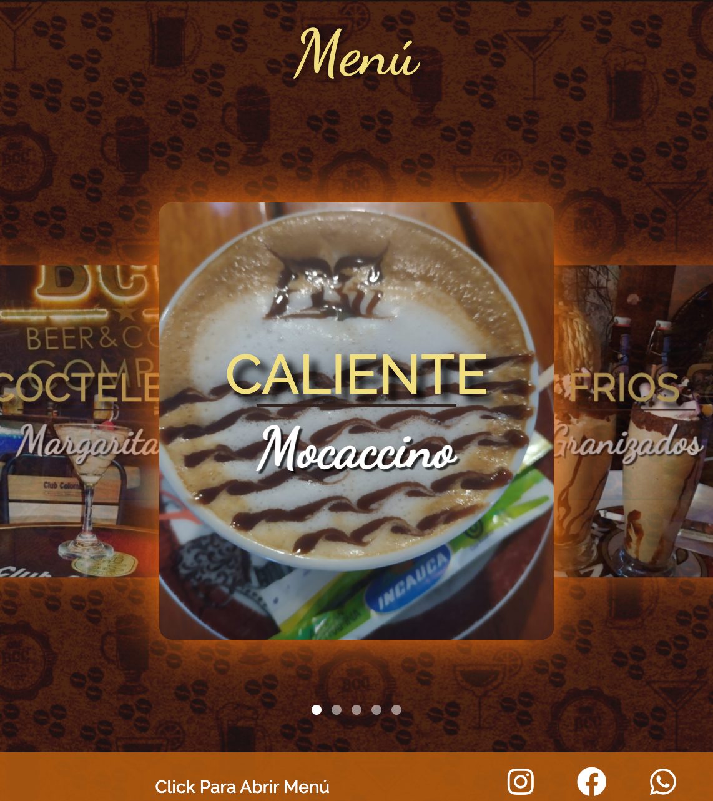

# BCC: Beer & Coffee Company - Página Web Estática

Este es un proyecto personal simple para crear una página web estática de un negocio de café-bar llamado **BCC: Beer & Coffee Company**. Este es mi primer proyecto personal, y en él utilizo el framework **Materialize CSS** para aprovechar su facilidad de uso en la creación de componentes como el carrusel.

## Descripción

La página está diseñada para mostrar el menú de **BCC**, que incluye una variedad de bebidas y alimentos como cervezas artesanales, café, cocteles y comida. El diseño es simple y directo, utilizando un carrusel para mostrar las diferentes categorías del menú. Cada imagen en el carrusel representa una categoría distinta del menú, y se puede interactuar con el contenido cuando la imagen está centrada.

## Características

- **Carrusel Dinámico**: Se utiliza el carrusel de **Materialize CSS** para mostrar las categorías del menú de manera visual y atractiva.
- **Página Estática**: El proyecto está completamente construido con HTML, CSS y JavaScript, sin necesidad de un backend.
- **Responsive Design**: El diseño se adapta a diferentes tamaños de pantalla, lo que lo hace accesible desde dispositivos móviles, tablets y computadoras.
- **OpenGraph y Twitter Cards**: Se implementaron las etiquetas meta para compartir la página de manera efectiva en redes sociales.

## Tecnologías Utilizadas

- **Materialize CSS**: Utilizado para los componentes de la interfaz de usuario, especialmente el carrusel.
- **HTML5 y CSS3**: Para la estructura y estilos básicos de la página.
- **JavaScript**: Para la funcionalidad del carrusel y los eventos de clic.
- **Font Awesome**: Para íconos sociales y enlaces.

## Instalación y Uso

Este es un proyecto estático simple, por lo que no necesita instalación de dependencias. Simplemente clona el repositorio y abre el archivo `index.html` en tu navegador:

```bash
git clone https://github.com/harakiriOP/beer-coffee-company.git
cd bcc-cafe-bar
```

Luego abre el archivo `index.html` en tu navegador.

## Capturas de Pantalla


